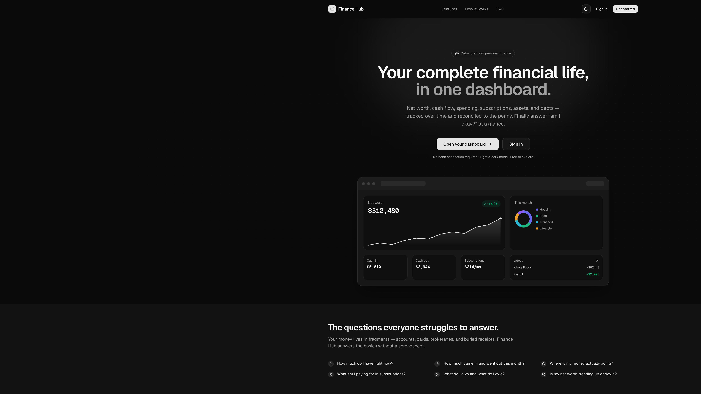
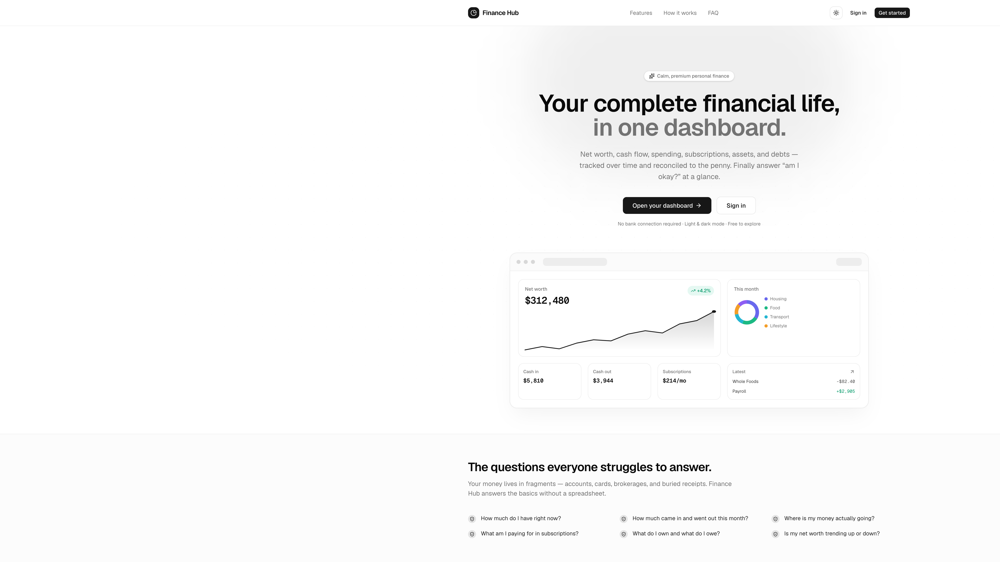
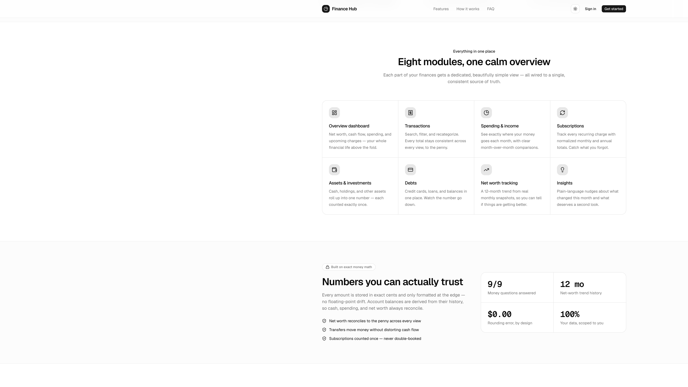

# Postmortem — "Home page" misinterpretation during landing page build

| | |
|---|---|
| **Date** | 2026-06-02 |
| **Author** | janmarshal (with AI pairing) |
| **Status** | Resolved |
| **Severity** | Low — no shipped impact; caught during the session, fully reverted |
| **Scope** | Initial Finance Hub frontend work (first feature build after scaffold) |

---

## Summary

The task was to **build the public landing page** for Finance Hub. The agent
misread "home page" as the **in-app Overview Dashboard** and built a full data +
domain layer plus dashboard view model before the user stopped it. All of that
work was reverted, and the actual landing page was then built, verified, and
screenshotted in light and dark mode.

Net result: correct landing page delivered, zero leftover artifacts from the
wrong path, ~1 detour that cost build time but no shipped impact.

---

## Impact

- **User impact:** None. Nothing was merged or deployed; the detour was caught
  in-session.
- **Wasted effort:** ~6 files (domain types, money math, finance aggregations,
  insights, demo data, dashboard accessor) written and then deleted.
- **Recovery:** Clean — `git status` confirmed the working tree returned to its
  pre-task state (only the pre-existing `PRD.md`/`CONTEXT.md`/`docs/` changes
  remained).

---

## Timeline (local time, UTC+4)

| Time | Event |
|------|-------|
| 23:00 | Task received: analyze PRD/CONTEXT/ADRs, then "start with the home page build." `emil-design-eng` skill attached. |
| 23:00–23:03 | Agent read PRD, CONTEXT, 3 ADRs, scaffold files, and the customized Next.js docs (incl. the `unstable_instant` navigation gotcha). |
| 23:03 | Agent interpreted "home page" as the **Overview Dashboard** and began building the data/domain layer + dashboard accessor + demo data. |
| 23:04 | **User interrupt:** "STOP… I asked you to build the homepage / landing page. revert all of these changes." |
| 23:04 | Agent deleted all 6 new `lib/*` files; verified clean working tree. |
| 23:05 | Agent confirmed scope via a quick multiple-choice check (full marketing page; CTAs → `/dashboard` + `/login`). |
| 23:05–23:08 | Built landing page: `app/page.tsx`, `components/landing/site-header.tsx`, `components/landing/dashboard-preview.tsx`, reduced-motion CSS. |
| 23:08 | Verified: lint clean, `tsc --noEmit` clean, `next build` succeeds (`/` static). |
| 23:09 | Captured screenshots in dark + light mode; both render correctly. |

---

## Root cause

**Ambiguous term + an over-eager prior.** "Home page" is genuinely ambiguous for
a product like this — it can mean the marketing landing page *or* the app's home
screen (the dashboard). The PRD's first concrete module is literally titled
"Overview Dashboard — *The home screen*," which biased the agent toward the
in-app reading. The agent committed to the heavier interpretation without
confirming scope first.

Contributing factors:

1. **No scope check before building.** A one-line confirmation up front would
   have caught the divergence before any code was written.
2. **Anchoring on the PRD.** "The home screen" phrasing in PRD §5.1 reinforced
   the wrong reading.
3. **Bias toward maximal work.** The agent jumped to the most substantial
   interpretation (full data/domain layer) rather than the lightest viable one.

---

## What went well

- **Fast, clean recovery.** Revert was a straight file delete; `git status`
  proved the tree was pristine afterward. Keeping the wrong work isolated to new
  `lib/*` files (no edits to existing files) made the revert trivial.
- **Scope confirmation after the correction.** A short multiple-choice question
  locked in "full marketing page" + CTA targets before rebuilding.
- **Verification discipline on the real deliverable.** Lint, typecheck, build,
  and real-browser screenshots in both themes.

## What went wrong

- Built first, clarified later — on an ambiguous noun.
- Spent real time on a domain/data layer that wasn't asked for yet.

---

## Evidence (screenshots)

Captured from a production build (`next build` + `next start`) at
`http://localhost:3000/`.

**Hero — dark mode**

**Hero — light mode**

**Features + "exact money math" trust section — light mode**

---

## Action items

| # | Action | Rationale |
|---|--------|-----------|
| 1 | For ambiguous scope nouns ("home page", "the app", "the page"), confirm interpretation in one line **before** writing code. | Cheapest possible guard against this class of detour. |
| 2 | Prefer the **lightest viable interpretation** first, then expand. | A minimal first pass is easy to redirect; a maximal one is expensive to throw away. |
| 3 | Consider renaming PRD §5.1 from "The home screen" to "The app's overview screen" to reduce future ambiguity. | The PRD wording actively nudged the wrong reading. |
| 4 | Keep new work isolated (new files over edits) early in a task when scope is uncertain. | Made this revert trivial; worth doing deliberately. |

---

## Artifacts from the successful build

- `app/page.tsx` — landing page
- `components/landing/site-header.tsx` — nav + CTAs
- `components/landing/dashboard-preview.tsx` — static hero mock (hand-built SVG line chart + donut)
- `app/globals.css` — added a `prefers-reduced-motion` block

CTAs point to `/dashboard` and `/login` (not yet implemented — expected to 404
until those routes are built).
